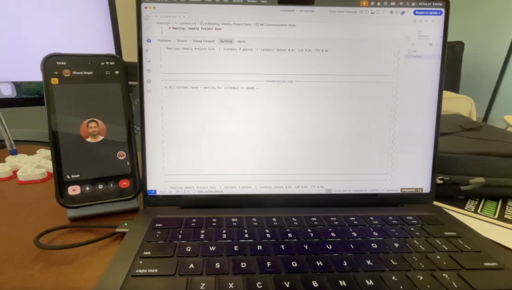

# ProxyCall

A local AI agent that attends your Google Meet calls, listens to conversations, and responds in your cloned voice. All AI inference runs locally on Apple Silicon — no cloud APIs for transcription, LLM, or voice synthesis. The only thing that leaves your machine is the audio going through Google Meet (obviously).

> **Disclaimer:** This is a fun experimental project built and tested only on Apple Silicon Macs (M4). It's not production-ready, will occasionally say odd things, and the latency is noticeable. Use it to amuse yourself, not to fool your boss.

## Demo

<!-- Replace VIDEO_URL with your CloudFront URL -->
[](https://dnwemruvsme5t.cloudfront.net/projects/ProxyCall-Demo.mp4)


## How It Works

```
Google Meet Audio → BlackHole → Voxtral ASR → Intent Classifier → LLM Response → VoiceBox TTS → Speakers
```

1. **Audio Capture** — Routes Google Meet audio through [BlackHole](https://existential.audio/blackhole/) virtual audio device
2. **Speech-to-Text** — [voxtral.c](https://github.com/antirez/voxtral.c) (Mistral's Voxtral Realtime 4B) transcribes speech in real-time
3. **Intent Detection** — Local LLM via [Ollama](https://ollama.com) decides if the utterance needs a response (greeting, question, sign-off, etc.)
4. **Response Generation** — Same LLM generates a contextual response using your meeting prep notes, handling noisy ASR by inferring intent from context
5. **Voice Synthesis** — [VoiceBox](https://voicebox.sh) clones your voice and speaks the response through your speakers

## Architecture

```
┌──────────────┐     ┌───────────────┐     ┌──────────────┐
│  BlackHole   │────▶│  voxtral.c    │────▶│  Transcript  │
│  16ch        │     │  (ASR)        │     │  Buffer      │
└──────────────┘     └───────────────┘     └──────┬───────┘
                                                  │
                     ┌───────────────┐            │
                     │  Meeting      │            │
                     │  Context (.md)│────┐       │
                     └───────────────┘    │       │
                                          ▼       ▼
┌──────────────┐     ┌──────────────┐  ┌──────────────┐
│  Speakers    │◀────│  VoiceBox    │◀─│  Ollama LLM  │
│  (audio out) │     │  (TTS)       │  │  (brain)     │
└──────────────┘     └──────────────┘  └──────────────┘
```

The orchestrator manages a state machine: `IDLE → LISTENING → DETECTING → THINKING → SPEAKING → IDLE`

The terminal UI shows two live panels:
- **Live Transcript** — real-time ASR output from the call
- **Conversation Log** — full dialogue (Colleague/You), pipeline status, and intent decisions

## Requirements

- **macOS** with Apple Silicon (M4 recommended)
- **24GB+ RAM** (runs everything locally but tight — 48-64GB recommended)
- **Python 3.11+**
- **BlackHole 16ch** — virtual audio driver
- **Ollama** — local LLM server
- **VoiceBox** — voice cloning TTS app
- **voxtral.c** — compiled from source (see below)

### Optional: Multi-Machine Setup

If you're RAM-constrained (24GB), you can offload Ollama to a second Mac on your local network:
- **Primary Mac**: voxtral.c (ASR) + VoiceBox (TTS) + audio capture
- **Secondary Mac**: Ollama (LLM)

On the secondary Mac:
```bash
brew install ollama
ollama pull qwen3:8b
OLLAMA_HOST=0.0.0.0 ollama serve
```

Then in your `config.yaml` on the primary Mac:
```yaml
llm:
  base_url: "http://192.168.1.x:11434"  # your secondary Mac's local IP
```

> **Note:** Intermittent "No route to host" errors can occur with remote Ollama over WiFi. The agent has built-in retry logic (3 attempts), but for reliability, running Ollama locally is recommended.

## Setup

### 1. Install Dependencies

```bash
# BlackHole virtual audio driver
brew install blackhole-16ch

# Ollama
brew install ollama
ollama pull llama3.1:8b  # or: qwen3:8b, phi4-mini, gemma3:4b

# VoiceBox — download from https://voicebox.sh
# After install, create a voice profile by recording a ~30s sample of your voice

# Python environment
python3.11 -m venv .venv
source .venv/bin/activate
pip install -r requirements.txt
```

### 2. Build voxtral.c (ASR Engine)

```bash
mkdir -p vendor
git clone https://github.com/antirez/voxtral.c.git vendor/voxtral.c
cd vendor/voxtral.c

make       # requires Xcode Command Line Tools
./download_model.sh  # ~2GB model weights

# Verify
./voxtral -d voxtral-model samples/jfk.wav

cd ../..
```

### 3. Configure Audio Routing

1. Set your **macOS system sound output** to `BlackHole 16ch`
2. In **Google Meet**, Chrome will use the system default output (BlackHole)
3. The agent captures from BlackHole and plays responses through your actual speakers

> **Important:** Chrome latches audio devices at launch. If you change the output device, quit Chrome fully and reopen it.

### 4. Configure the Agent

```bash
cp config.example.yaml config.yaml
```

Edit `config.yaml`:
- `agent.name` — your name
- `agent.trigger_names` — add common ASR misrecognitions of your name
- `audio.capture_device` — `"BlackHole 16ch"`
- `audio.playback_device` — your speaker device name
- `llm.model` — Ollama model name
- `llm.base_url` — Ollama URL (localhost or remote machine)
- `tts.voice_profile_id` — your VoiceBox voice profile ID

### 5. Prepare Meeting Context

The meeting context file is **the most important part** — it's what makes the agent give relevant answers instead of generic ones. Think of it as your meeting prep notes that the agent reads before the call.

```bash
cp meetings/example.md meetings/current.md
```

Edit `meetings/current.md` **before every call** with:

| Section | What to put | Why it matters |
|---------|-------------|----------------|
| **Your Key Context** | Facts, status updates, what you shipped, what's in progress | The agent uses this to answer "what's the status?" questions |
| **Your Positions** | Pre-loaded answers for expected questions (timeline, risks, blockers) | Direct control over what the agent says — "If asked about X, say Y" |
| **Communication Style** | How you speak (direct, casual, formal) | Keeps responses sounding like you |
| **Things to Avoid** | Topics, numbers, or commitments the agent should never make up | Prevents hallucination and overpromising |

**Example — before a weekly sync:**
```markdown
## Your Key Context:
- Finished the API refactor, pushed to staging on Wednesday
- Production is stable, no incidents this week
- Blocked on design review for the dashboard redesign

## Your Positions:
- If asked about timeline: API refactor ships Monday, dashboard depends on design team
- If asked about risks: only risk is the design dependency
- If asked about production: all green, no issues
```

The better your prep, the better the responses. The agent will say "let me get back to you on that" for anything not covered — which is the right thing to do.

## Usage

```bash
source .venv/bin/activate

# Run with terminal UI (recommended)
python -m src.main

# Run with debug logging (first run)
python -m src.main --debug

# Watch the pipeline in another terminal
tail -f voiceagent.log

# Listen-only mode (transcribe but don't respond)
python -m src.main --listen-only

# No UI mode (prints transcript to stdout)
python -m src.main --no-ui

# Custom meeting context
python -m src.main --meeting meetings/my-standup.md
```

### Terminal UI

The agent runs a live Rich terminal dashboard with:

```
┌─ Voice Agent ────────────────────────────────┐
│ Status: LISTENING      [M]ute [F]orce [S]kip [Q]uit │
├──────────────────────────────────────────────┤
│ Live Transcript (ASR)                         │
│ Hey good morning, how's the project going?    │
├───────────────────────────────────────────────┤
│ Conversation Log                              │
│ >> All systems ready — waiting for colleague  │
│ Colleague: Hey good morning, how's the        │
│   project going?                              │
│ >> Silence detected, analyzing intent...      │
│ >> Classifying intent via LLM...              │
│ >> Responding to: greeting + project status   │
│ >> Generating response via LLM...             │
│ >> Synthesizing voice...                      │
│ You: Good morning! The API refactor shipped   │
│   to staging Wednesday, all green so far.     │
│ >> Waiting for colleague to speak...          │
├───────────────────────────────────────────────┤
│ Meeting: Weekly Sync | Latency: Intent 2.1s   │
│   LLM 3.4s  TTS 8.2s                          │
└───────────────────────────────────────────────┘
```

### Keyboard Controls

| Key | Action |
|-----|--------|
| `M` | Toggle mute (still transcribes but won't respond) |
| `F` | Force respond to the last utterance |
| `S` | Skip/stop current response playback |
| `Q` | Quit |

## Project Structure

```
src/
├── main.py              # CLI entry point
├── orchestrator.py       # Central state machine + pipeline
├── audio/
│   ├── capture.py       # BlackHole audio capture (48kHz→16kHz resampling)
│   ├── devices.py       # Audio device discovery
│   └── playback.py      # Speaker output
├── asr/
│   └── voxtral.py       # voxtral.c subprocess wrapper (stdin/stdout)
├── brain/
│   ├── context.py       # Meeting markdown parser
│   ├── intent.py        # Intent classifier with retry logic
│   ├── gate.py          # Confidence threshold gate
│   └── responder.py     # Response generator with retry logic
├── transcript/
│   └── buffer.py        # Rolling transcript buffer
├── voice/
│   └── tts.py           # VoiceBox TTS client
└── ui/
    └── terminal.py      # Rich terminal dashboard
```

## Test Scripts

```bash
# Test BlackHole audio loopback
python scripts/test_blackhole.py

# Test audio capture from BlackHole
python scripts/test_audio_pipeline.py

# Test live transcription
python scripts/test_live_transcription.py

# Test intent classification and response generation
python scripts/test_brain.py
```

## Known Limitations

- **Latency** — End-to-end response takes 15-30s on 24GB machines (intent ~2-5s + response ~3-5s + TTS ~8-15s). More RAM and a dedicated GPU machine help significantly.
- **ASR quality** — Small model (4B) on constrained memory misses words, especially with low audio. The LLM prompts are tuned to infer meaning from noisy transcriptions using meeting context.
- **ASR restarts** — On memory-constrained machines, voxtral.c stops during TTS to free GPU memory, causing a few seconds of deaf time after each response.
- **Single speaker** — Optimized for 1-on-1 calls. Group calls would need diarization (not yet implemented).
- **English only** — ASR and TTS are configured for English.
- **macOS only** — Depends on BlackHole, Metal GPU acceleration, and macOS audio APIs.

## Tech Stack

| Component | Technology | License |
|-----------|-----------|---------|
| ASR | [voxtral.c](https://github.com/antirez/voxtral.c) (Voxtral Realtime 4B) | Apache 2.0 |
| LLM | [Ollama](https://ollama.com) + Llama 3.1 8B / Qwen3 8B | Various |
| TTS | [VoiceBox](https://voicebox.sh) (Qwen3-TTS) | MIT |
| Audio | [BlackHole 16ch](https://existential.audio/blackhole/) + sounddevice | MIT |
| UI | [Rich](https://github.com/Textualize/rich) terminal dashboard | MIT |
| Language | Python 3.11+ with asyncio | — |

## License

MIT
